# mpweixinA057
mpweixinA057调查问卷微信小程序LW+PPT
 
## 查看主页获取源码

### 一、作品包含

源码+数据库+设计文档万字+PPT+全套环境和工具资源+部署教程

### 二、项目技术

前端技术：Html、Css、Js、Vue、Element-ui、Uniapp

数据库：MySQL

后端技术：Java、Spring Boot、MyBatis

  

### 三、运行环境

开发工具：IDEA/eclipse + HBuilderX + 微信开发者工具

数据库：MySQL5.7

数据库管理工具：Navicat10以上版本

环境配置软件： JDK1.8+Maven3.6.3

前端Nodejs：14

### 四、项目介绍
项目编号：mpweixinA057

随着社会的不断进步与发展，用户对调查问卷管理的要求逐步提升。如果开发一款调查问卷管理系统，可以让用户在最短的时间里享受到最好的服务；而开发本系统，又能够提高系统整体工作水平，简化工作程序，这对管理员和用户来说都是一件非常乐意的事情。

调查问卷管理系统主要分为前台客户端、后台管理端。
前台客户端包括用户，主要的功能为：注册登录，对个人中心、调查问卷、问卷结果、我的收藏管理等功能进行操作。
后台管理端主要功能为：系统首页、个人中心、用户管理、问卷类型管理、调查问卷管理、问卷结果管理、系统管理等功能。

### 五、运行截图

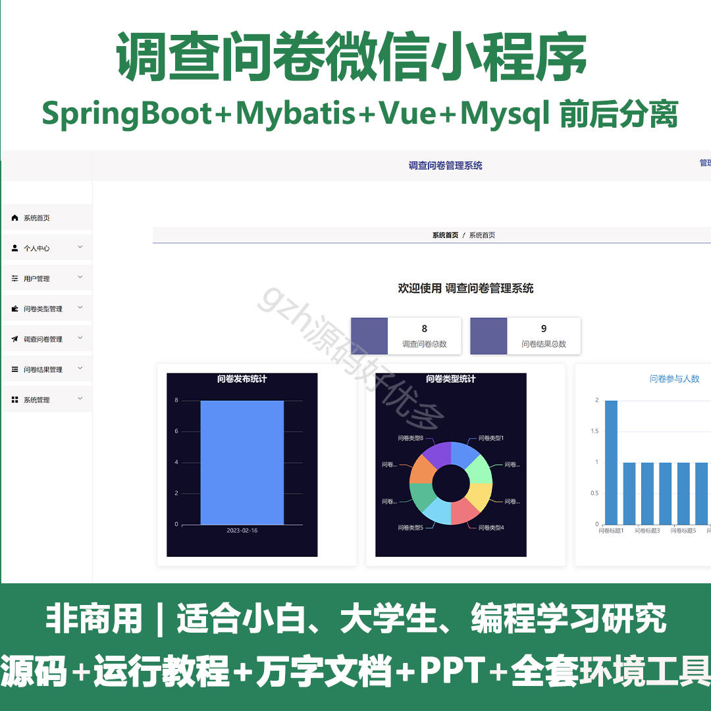
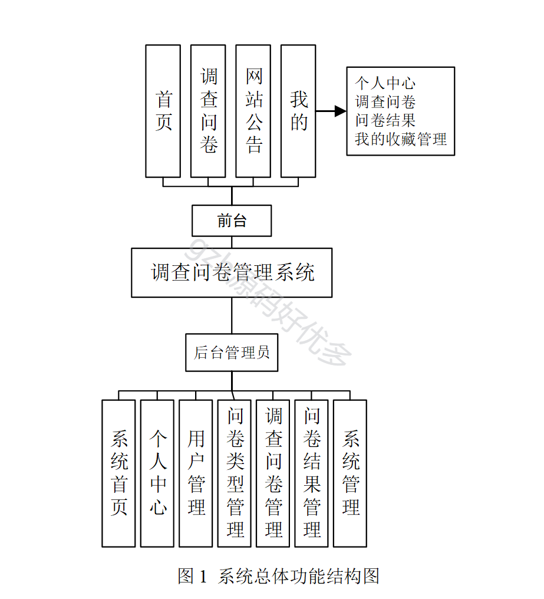
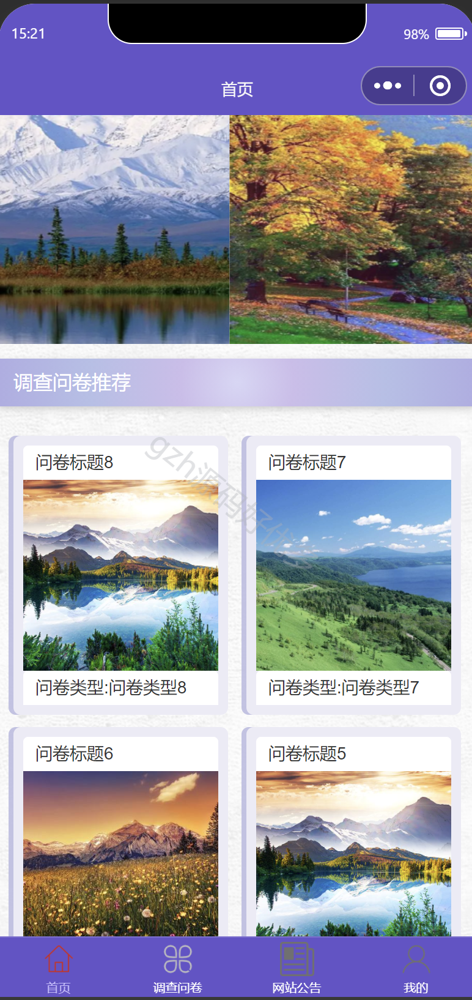
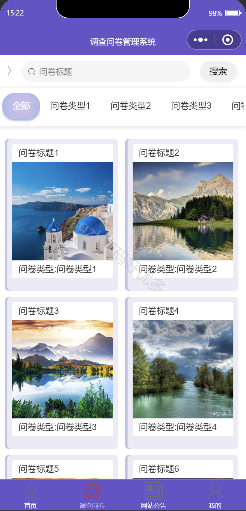
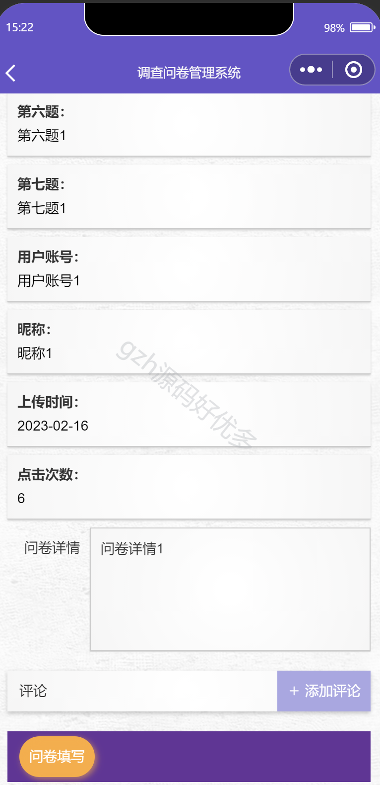
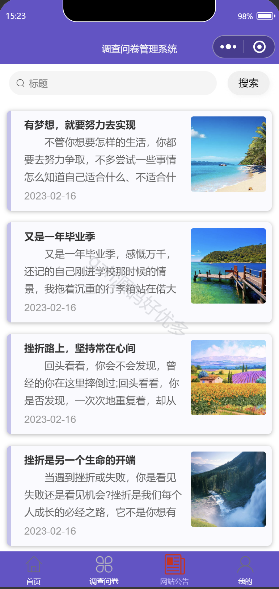
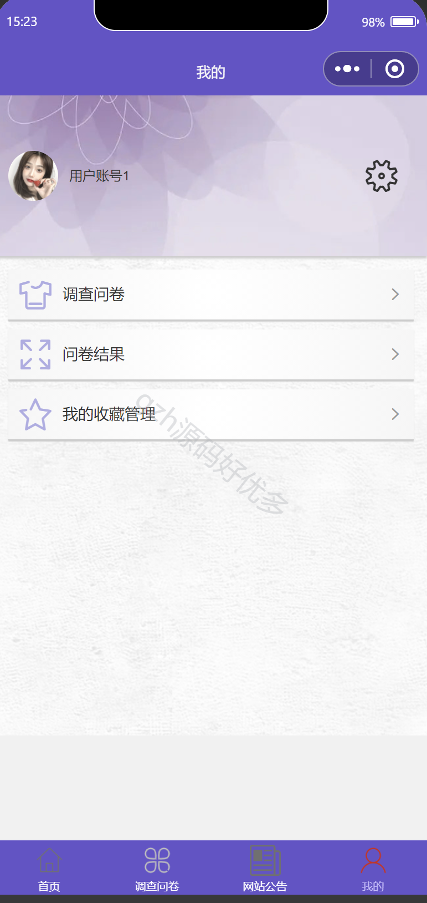
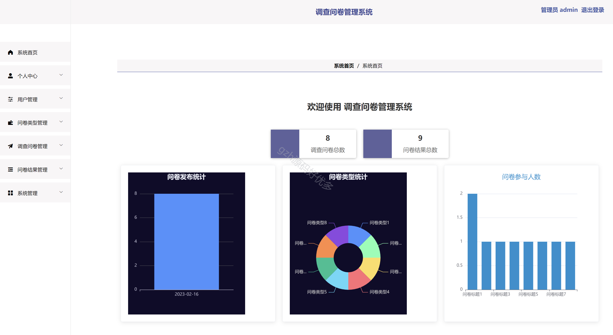
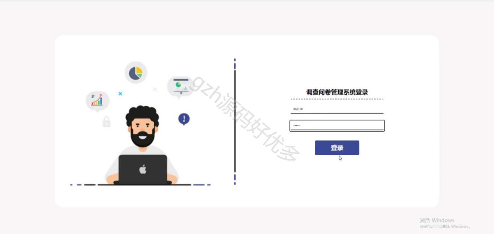
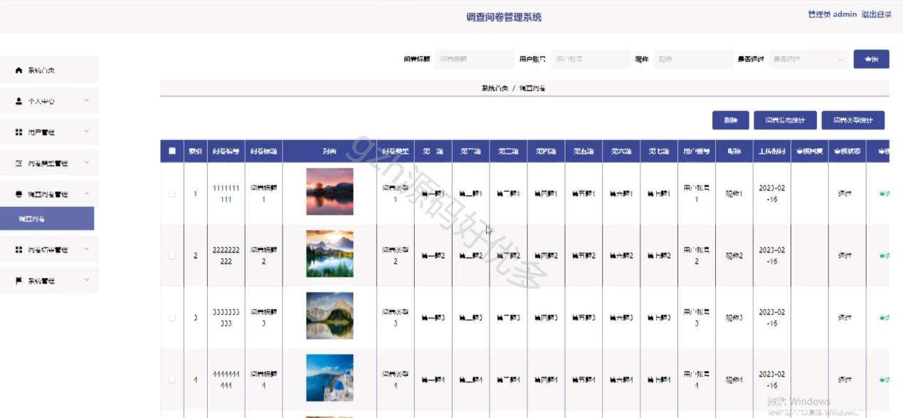
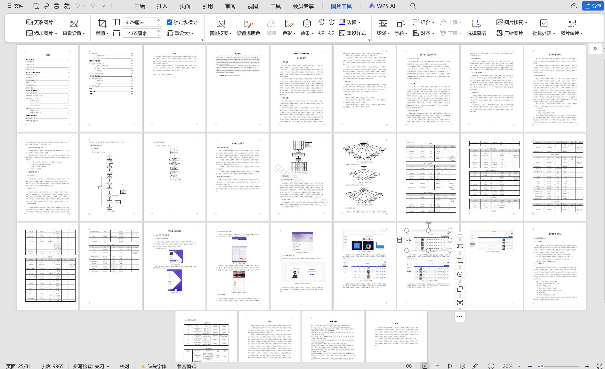

  
